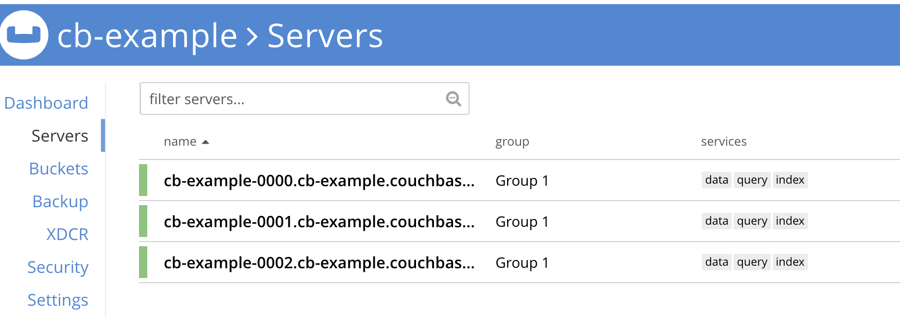
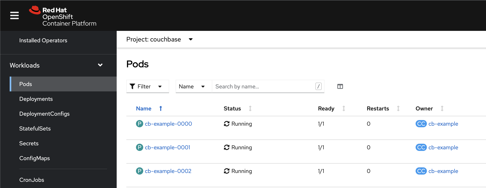
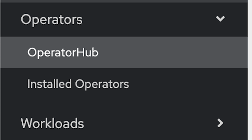

# Couchbase Operator For OpenShift

The Couchbase Operator allows users to deploy Couchbase on OpenShift while significantly reducing the operational complexities typically associated with managing and scaling databases.

Related resources:

- [Autonomous Operator Overview](https://docs.couchbase.com/operator/current/overview.html)
- [Installing on OpenShift](https://docs.couchbase.com/operator/current/install-openshift.html)
- [Red Hat Partner Demo System](https://rhpds.redhat.com/)

## Summary

This guide is intended to be run with with Red Hat's OpenShift Workshop on [RHPDS (Partner Demo System)](https://rhpds.redhat.com/) for demos and workshops. It provides steps and examples for deploying Couchbase clusters using the Autonomous operator.

All of these steps can also be run on any other supported OpenShift environment (tested on 4.10). Just replace the URLs in the steps below with the address to your environment. Throughout this guide you will see references to `CLUSTER_ID`. This ID is different each time a PDS cluster is created. Please reach out to partners@couchbase.com if you need access to a cluster, and a complete URL with `CLUSTER_ID` will be provided.

The RHPDS environment should be deployed using the "Couchbase Cluster OpenShift Demo & Workshop" from the "Multi-Product Demo" Service Catalog.  Your cluster will be deployed with a current version of OpenShift and the latest published Couchbase Operator.

# Setup

### Login to Red Hat OpenShift Container Platform

The first step is to login to OpenShift from your local browser AND terminal.

Open  https://console-openshift-console.apps.cluster-<CLUSTER_ID>.opentlc.com in your browser and login:

- username: cluster-mgr
- password: <Provided-in-RHPDS-confirmation-email>


On the main console page, navigate to 'cluster-mgr' in the upper right hand corner and click 'copy login command' for command-line access.  Click 'Display Token' and paste the output to your terminal.

```
oc login --token=sha256~QMJIQOfJq00YNoVh2nQUgwsy6ZifXS7Jt4OTsnJAP8Q --server=https://api.cluster-<CLUSTER_ID>.opentlc.com:6443
```

> Note: cluster-mgr is a cluster admin account. Cluster admin privileges are advised to install the Couchbase Cluster.

### Create Project

Next, we need to create a project.

```
oc new-project customer360
```

This command creates the `customer360` project and switches to it.

### Deploy Couchbase Credentials Secret

The Couchbase clusters deployed in the following steps will use the credentials provided in the `cb-example-auth` secret. Deploying `secret.yaml` will create the secret.

```
oc create -f secret.yaml
```

# Cluster Recipes

### Deploy a Basic Couchbase Cluster

The cluster that we'll deploy will be a simple, 3 node cluster, with one bucket and 2 replicas.

```
oc create -f cluster-basic.yaml
```

You should start seeing Couchbase pods appearing immediately. It will take a couple of minutes for the cluster to be ready.

```
oc get pods -w
NAME                                  READY     STATUS    RESTARTS   AGE
cb-example-0000                       1/1       Running   0          3m
cb-example-0001                       1/1       Running   0          3m
cb-example-0002                       1/1       Running   0          2m
```
> Remember to hit `ctrl + c` to escape.

### Expose the Couchbase UI

Next, expose the Couchbase UI so you can log into it:

```
oc expose service/cb-example-ui
```

Get the route to the Couchbase UI:

```
oc get routes
NAME            HOST/PORT                                                             PATH      SERVICES        PORT        TERMINATION   WILDCARD
cb-example-ui   cb-example-ui-couchbase.apps.cluster-<DLUSTER_ID>.opentlc.com            cb-example-ui   couchbase-ui                 None
```

Open the URL outputted by `oc get routes` in your browser adding /ui/index.html at the end and login with:
> Username: Administrator
> Password: password 

Navigate to "Servers" to see the server list:



On the Pods page in OpenShift (https://console-openshift-console.apps.cluster-<CLUSTER_ID>.opentlc.com/k8s/ns/couchbase/pods):




### Deploy the Red Hat Integration Operator from OperatorHub



Search for Red Hat Integration

Install into “All namespaces on the cluster (default)
Once the Operator is installed, click Create instance

#### Install the AMQ Streams Operator

Create a Red Hat Integration Installation for AMQ Streams

```
apiVersion: integration.redhat.com/v1
kind: Installation
metadata:
 name: rhi-installation
spec:
 3scale-apicast-installation:
   enabled: false
   mode: namespace
   namespace: rhi-3scale-apicast
 amq-broker-installation:
   enabled: false
   mode: namespace
   namespace: rhi-amq-broker
 fuse-online-installation:
   enabled: false
   mode: namespace
   namespace: rhi-fuse-online
 api-designer-installation:
   enabled: false
   mode: namespace
   namespace: rhi-api-designer
 3scale-installation:
   enabled: false
   mode: namespace
   namespace: rhi-3scale
 amq-interconnect-installation:
   enabled: false
   mode: namespace
   namespace: rhi-amq-interconnect
 service-registry-installation:
   enabled: false
   mode: namespace
   namespace: rhi-service-registry
 camel-k-installation:
   enabled: false
   mode: cluster
 fuse-console-installation:
   enabled: false
   mode: namespace
   namespace: rhi-fuse-console
 amq-streams-installation:
   enabled: true
   mode: cluster
```
#### Deploy Kafka

Once the installation is complete, navigate to Installed Operators and click on Red Hat Integration AMQ Streams

Click Create Kafka
```
apiVersion: kafka.strimzi.io/v1beta1
kind: Kafka
metadata:
 name: my-cluster
 namespace: customer360
spec:
 clientsCa:
   certificateExpirationPolicy: renew-certificate
   generateCertificateAuthority: true
   renewalDays: 30
   validityDays: 365
 kafka:
   config:
     auto.create.topics.enable: "true"
     offsets.topic.replication.factor: 1
     transaction.state.log.replication.factor: 1
     transaction.state.log.min.isr: 1
     log.message.format.version: '2.6'
     inter.broker.protocol.version: '2.6'
   version: 2.6.0
   storage:
     type: ephemeral
   replicas: 1
   listeners:
     - name: plain
       port: 9092
       type: internal
       tls: false
     - name: tls
       port: 9093
       type: internal
       tls: true
 entityOperator:
   topicOperator: {}
   userOperator: {}
 zookeeper:
   storage:
     type: ephemeral
   replicas: 1
 clusterCa:
   certificateExpirationPolicy: renew-certificate
   generateCertificateAuthority: true
   renewalDays: 30
   validityDays: 365
```
Note: The process will take a few minutes while all resources are being created.
Once complete you should see the status as:

Note: The Warning, Warning conditions are due to single replicas of the zookeeper and kafka brokers and can be ignored for this demo.

#### Deploy Kafka Connect

```
kind: KafkaConnect
metadata:
  name: my-connect-cluster
  namespace: customer360
spec:
  bootstrapServers: 'my-cluster-kafka-bootstrap:9093'
  version: 2.6.0
  tls:
    trustedCertificates:
      - secretName: my-cluster-cluster-ca-cert
        certificate: ca.crt
  config:
    config.storage.replication.factor: 1
    offset.storage.replication.factor: 1
    status.storage.replication.factor: 1
  image: 'dschexna/couchbezium:latest'
  replicas: 1
```
Create a route for the kafka-connect deployment

#### Install MySQL

Deploy the Debezium MySQL instance with some tables pre-populated.

```
oc new-app --name=mysql debezium/example-mysql:1.4 -e MYSQL_ROOT_PASSWORD=debezium -e MYSQL_USER=mysqluser -e MYSQL_PASSWORD=mysqlpw
```
Access the MySQL instance
```
oc exec -it mysql-5478fc7f96-8fkmh -- bash -c 'mysql -u $MYSQL_USER -p$MYSQL_PASSWORD inventory'
```
Show tables in the ‘inventory’ database
```
mysql> show tables;
+---------------------+
| Tables_in_inventory |
+---------------------+
| addresses           |
| customers           |
| geom                |
| orders              |
| products            |
| products_on_hand    |
+---------------------+
6 rows in set (0.00 sec)
```
Post the configuration for the Kafka connector for MySQL
```
curl -X POST \
    -H "Accept:application/json" \
    -H "Content-Type:application/json" \
    http://my-connect-cluster-api-customer360.apps.ocpeast1aws.couchbasedemos.com/connectors -d @- <<'EOF'
{
    "name": "inventory-connector",
    "config": {
        "connector.class": "io.debezium.connector.mysql.MySqlConnector",
        "tasks.max": "1",
        "database.hostname": "mysql",
        "database.port": "3306",
        "database.user": "root",
        "database.password": "debezium",
        "database.server.id": "184054",
        "database.server.name": "dbserver1",
        "database.include.list": "inventory",
        "database.history.kafka.bootstrap.servers": "my-cluster-kafka-bootstrap:9092",
        "database.history.kafka.topic": "schema-changes.inventory"
    }
}
EOF
```
Post the configuration for the Kafka connector for Couchbase
```
curl -X POST \
    -H "Accept:application/json" \
    -H "Content-Type:application/json" \
    http://my-connect-cluster-api-customer360.apps.ocpeast1aws.couchbasedemos.com/connectors -d @- <<'EOF'

{
    "name": "customers-sink",
    "config": {
        "connector.class": "com.couchbase.connect.kafka.CouchbaseSinkConnector",
        "tasks.max": "2",
        "topics" : "dbserver1.inventory.customers",
        "couchbase.seed.nodes" : "cb-example-0000",
        "connection.timeout.ms" : "2000",
        "couchbase.bucket" : "staging",
        "couchbase.username" : "Administrator",
        "couchbase.password" : "password",
        "couchbase.durability.persist_to" : "NONE",
        "couchbase.durability.replicate_to" : "NONE",
        "key.converter" : "org.apache.kafka.connect.storage.StringConverter",
        "value.converter" : "org.apache.kafka.connect.json.JsonConverter",
        "value.converter.schemas.enable" : "false"
    }
}
EOF
```

#### Couchbase Query Workbench

The data should now be populated from MySQL into Couchbase.

From the Couchbase Web UI, create a primary index for querying the data:

```
create primary index on staging;
```
View the records populated via Kafka
```
select s.payload.after
R
from staging s;
```
#### MySQL command-line

Alter a single record
```
UPDATE customers SET first_name='Anne Marie' WHERE id=1004;
```
Insert records
```
INSERT INTO customers VALUES (default, "Nick", "Wallace", "nick@acme.com");
INSERT INTO customers VALUES (default, "Jacob", "Gay", "jgay@data.com");
INSERT INTO customers VALUES (default, "David", "Rojas", "drojas@acme.com");
INSERT INTO customers VALUES (default, "Ryan", "Massey", "rmassey@acme.com");
INSERT INTO customers VALUES (default, "Anthony", "Farinha", "kander@acme.com");
INSERT INTO customers VALUES (default, "Paul", "Brown", "pbrown@earthlink.net");
```

### Cleanup

The quickest way to reset the cluster back to the beginning, is to just delete the project. 

```
oc delete project customer360
```

[def]: https://docs.couchbase.com/operator/current/install-openshift.html